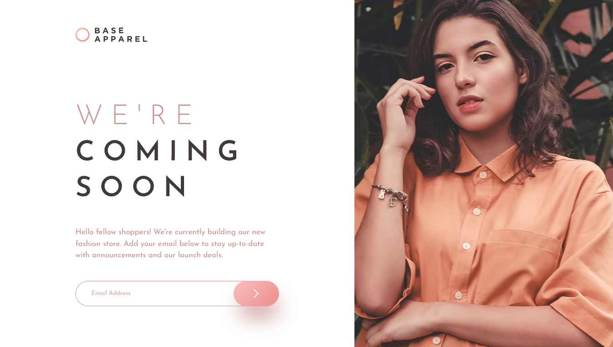
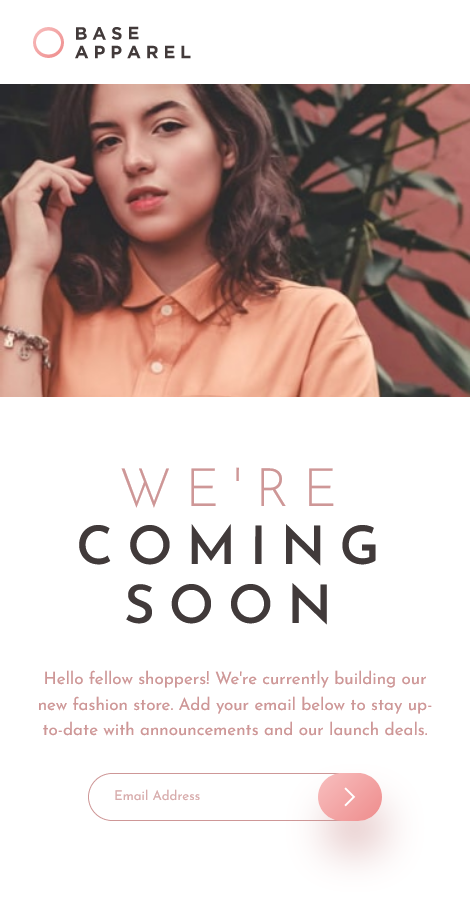

# Frontend Mentor - Apparel Coming soon page

This is a solution to the [Base Apparel coming soon page challenge on Frontend Mentor](https://www.frontendmentor.io/challenges/base-apparel-coming-soon-page-5d46b47f8db8a7063f9331a0). 

## Table of contents

- [Overview](#overview)
  - [The challenge](#the-challenge)
  - [Screenshot](#screenshot)
  - [Links](#links)
- [My process](#my-process)
  - [Built with](#built-with)
- [Author](#author)

## Overview

### The challenge

Users should be able to:

- View the optimal layout for the site depending on their device's screen size
- See hover states for all interactive elements on the page
- Receive an error message when the `form` is submitted if:
  - The `input` field is empty
  - The email address is not formatted correctly

### Screenshot

### Links

- Solution URL: [Code On Github](https://github.com/zeynabmvs/apparelComingSoon)
- Live Site URL: [Live site](https://apparelcomingsoon.pages.dev/)

## My process

### Built with

- Semantic HTML5 markup
- CSS custom properties
- Flexbox
- CSS Grid
- Mobile-first workflow

## Author

- Frontend Mentor Profile - [@zeynabmvs](https://www.frontendmentor.io/profile/yourusername)
- LinkedIn - [@Zeynab movasaqpoor](www.linkedin.com/in/zeynab-movasaqpoor-485b57b1)
